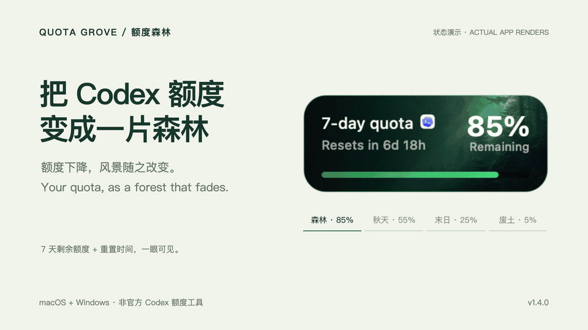

# Quota Grove · 额度森林

**把 Codex 的剩余额度，变成一片会枯萎的森林。**

桌面上随时查看 Codex 的 **7 天剩余额度与重置时间**。额度下降时，森林逐渐走向秋天、末日与废土。支持 macOS 与 Windows。

[English](README.en.md) · [最新版本 v1.4.0](https://github.com/Ayang0097/quota-grove/releases/latest) · [反馈问题](https://github.com/Ayang0097/quota-grove/issues/new/choose)

| macOS Apple Silicon | Windows 10 / 11 x64 |
| :---: | :---: |
| **[下载 macOS 版](https://github.com/Ayang0097/quota-grove/releases/download/v1.4.0/Quota-Grove-v1.4.0-macos-arm64.zip)** | **[下载 Windows 版](https://github.com/Ayang0097/quota-grove/releases/download/v1.4.0/Quota-Grove-v1.4.0-windows-x64.zip)** |
| macOS 13+ · 解压后拖入“应用程序” | 便携版 · 解压后运行 `QuotaGrove.exe` |

> 适用于本机已产生 Codex 额度记录的用户。macOS 下载包仅支持 Apple Silicon，Windows 下载包仅支持 x64。首次启动提示见下方。

## 用起来是什么感觉？

- **抬眼就能看额度**：周额度与重置时间常驻桌面；单击展开订阅计划和数据更新时间。
- **忙的时候收在边上**：拖到屏幕边缘自动收纳，悬停展开，减少遮挡。
- **额度变化看得见**：`70–100%` 森林、`40–<70%` 秋天、`10–<40%` 末日、`0–<10%` 废土。
- **读取额度不消耗 Token**：每 10 秒读取本机记录，不调用模型，也不上传额度日志。

## 安装与第一次使用

**macOS**：下载上方 ZIP，解压，把 `Quota Grove.app` 拖入“应用程序”后打开。当前构建使用 ad-hoc 签名，尚未经过 Apple Developer ID 公证。若系统无法验证开发者，请先确认下载来自本仓库；尝试打开一次后，可在“系统设置 → 隐私与安全”中按系统提示选择“仍要打开”。参见 [Apple 的说明](https://support.apple.com/en-us/102445)。

**Windows**：下载上方 ZIP，完整解压到一个文件夹，运行 `QuotaGrove.exe`。无需安装 .NET。当前构建没有商业代码签名证书，可能显示 SmartScreen 提示；请核对下载来源与 [SHA-256 校验值](https://github.com/Ayang0097/quota-grove/releases/download/v1.4.0/SHA256SUMS-v1.4.0.txt)。

打开本机 Codex 并正常使用，等待产生额度记录。卡片显示后，**单击展开、双击刷新、拖动贴边、右键设置**。macOS 版会跟随 Codex/ChatGPT 桌面客户端显示或隐藏。

## v1.4.0 有什么新内容？

本次将已提交的背景套系与额度分段更新打包到正式下载版，让下载内容与页面展示保持一致。

| 能力 | macOS | Windows |
| --- | :---: | :---: |
| 周额度、重置时间、贴边收纳 | ✓ | ✓ |
| 四种额度状态与双击落叶 | ✓ | ✓ |
| 五套背景、自定义背景 | ✓ | — |
| 可选的当地天气雨雪动效 | ✓ | — |

macOS 提供额度森林、星屿生态舱、云海灯塔、月光花房、深海幻境五套背景。右键卡片 →“背景套系”切换。

查看五套背景与动效

更多动效和细节见 [功能与技术参考](docs/technical-guide.md)。

## 常见问题

**为什么显示 `--%`，或者数据暂时没有变化？** 额度来自本机 Codex 记录。尚无可信记录时显示 `--%`；暂时没有新记录时保留最近可信结果。单击展开可查看更新时间，双击可重新扫描。它不保证与服务端状态实时同步。

**需要 API Key 吗？会上传日志吗？** 不需要 API Key；不上传额度或 Codex 日志，不包含遥测。macOS 天气功能默认关闭，主动开启后才使用模糊化位置查询天气。见 [隐私说明](PRIVACY.md)。

**支持其他额度窗口或平台吗？** 当前主要展示本机 Codex 的 7 天总额度，下载包支持上表中的系统。暂无 Linux 或 Intel Mac 下载包。

**这是官方产品吗？** 不是。Quota Grove 是独立的非官方工具，与 OpenAI 无隶属或背书关系。卡片中的 Codex 图标仅用于标识数据来源。

## 反馈与支持

遇到安装或数据显示问题，请 [提交问题](https://github.com/Ayang0097/quota-grove/issues/new/choose)，附上操作系统、应用版本、复现步骤和已打码的截图。请勿上传完整 Codex 日志或账号凭据。

如果它对你有帮助，欢迎点一个 **Star**，方便以后找到项目，也让更多 Codex 用户发现它。

[从源码构建与完整功能说明](docs/technical-guide.md) · [Windows 开发说明](windows/README.md) · [数据来源](data-source-notes.md) · [第三方声明](THIRD_PARTY_NOTICES.md)

代码、文档与自有视觉资产使用仓库现有的 [保留权利许可](LICENSE)。Codex 图标及相关商标属于各自权利人，具体范围见 [素材来源](asset-sources.md)。
