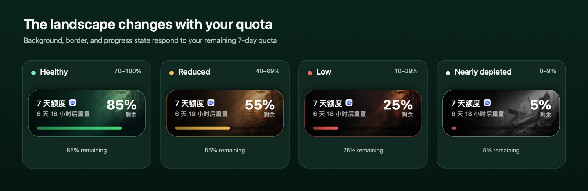
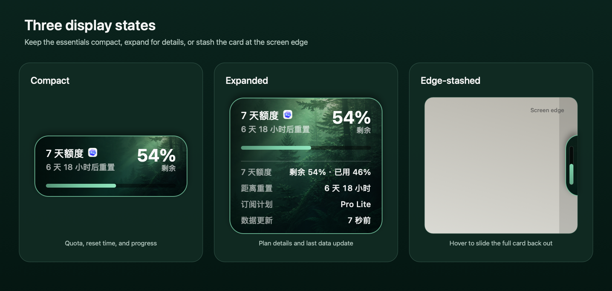

# Quota Grove · 额度森林

Quota Grove 是一个支持 macOS 与 Windows 的桌面悬浮卡片，用环境变化显示本机 Codex 的 7 天剩余额度和重置时间。

卡片标题旁的 Codex 图标仅用于标明额度数据来自用户本机的 Codex/ChatGPT 桌面客户端；它不是 Quota Grove 的应用图标、仓库标志或产品品牌。

## 效果展示

### 不同额度主题

卡片会根据 7 天剩余额度切换环境，背景、边框颜色和进度条保持一致：`50–100%` 为森林、`20–49%` 为秋天、`3–19%` 为末日、`0–2%` 为废土。



### 主题同步落叶动效

macOS 卡片会在额度下降时播放落叶，并在卡片可见且系统未开启“减少动态效果”时，每 5 秒自动播放一次轻量环境动效。叶片颜色跟随当前额度主题：森林为鲜绿、秋林为橙红、末日为暗红褐、废土为灰白。


### 收起、展开与贴边隐藏

收起状态保留核心额度信息；单击卡片展开订阅计划和数据更新时间；拖到屏幕左右边缘后自动收纳成 16 pt 的深色主题切片，悬停时完整卡片会临时滑出。



## 特点

- macOS 为 `200 × 80 pt` 收起、`200 × 178 pt` 展开；Windows 为 `400 × 160 DIP` 收起、`400 × 356 DIP` 展开。
- 森林、秋天、末日、废土四套本地绘制主题。
- macOS 支持额度下降触发和每 5 秒一次的轻量落叶动效；叶片颜色、进度条和边框与当前主题同步。
- 根据系统首选显示语言自动使用中文或英文；中文系统显示中文，其他系统默认显示英文。
- 双击刷新；单击与双击互不误触。
- 任意位置拖动并记住位置；贴到屏幕左右边缘后收纳成 16 pt 的深色主题卡片切片，内嵌竖向额度条。
- macOS 版会跟随 Codex/ChatGPT 桌面客户端显示或隐藏；Windows 版保留最近一次可信快照，Codex 暂时退出时仍可查看。
- 右键可刷新、重置位置、管理登录启动和退出。
- 不占用 macOS Dock 或 Windows 任务栏，无网络上传、无遥测。

## 系统要求

- macOS 13 或更高版本，Apple Silicon Mac（arm64）；或 Windows 10/11 x64。
- 本机 Codex/ChatGPT 桌面客户端产生过含额度状态的运行事件。

## 下载与安装

前往 [GitHub Releases](https://github.com/Ayang0097/quota-grove/releases/latest) 下载对应系统版本：

- macOS：`Quota-Grove-*-macos-arm64.zip`，解压后将 `Quota Grove.app` 拖入“应用程序”文件夹。
- Windows：`Quota-Grove-*-windows-x64.zip`，解压后运行 `QuotaGrove.exe`。这是便携版，不要求预装 .NET。

当前公开构建采用 ad-hoc 签名，尚未经过 Apple Developer ID 公证。首次打开时如果 macOS 提示无法验证开发者，请在 Finder 中按住 Control 点击应用，选择“打开”，然后再次确认“打开”。

Windows 公开构建当前没有商业代码签名证书，首次运行可能出现 Microsoft Defender SmartScreen 提示；请仅从本仓库 Releases 下载，并可使用随包提供的 SHA-256 校验值核对文件。

## 从源码构建

### macOS

在项目目录运行：

```bash
./install.sh
```

脚本会构建 Release 应用、进行 ad-hoc 签名、安装到：

```text
~/Applications/Quota Grove.app
```

然后自动启动。右键卡片，勾选“登录时启动”可创建用户级 LaunchAgent，不需要管理员权限。

### Windows

需要 .NET 8 SDK。测试、构建和便携版发布命令见 [Windows 开发说明](windows/README.md)。公开下载包为自包含的 Windows x64 单文件应用。

## 使用

- 单击：展开或收起。
- 双击：立即重新扫描本机额度事件。
- 拖动：移动卡片；拖到当前显示器可用区域的左/右边缘后收纳。
- 悬停收纳条：临时滑出完整卡片。
- 右键：打开刷新、登录启动、位置重置、隐私和退出菜单。

## 验证真实数据

macOS 应用附带两个不启动窗口的诊断命令：

```bash
"~/Applications/Quota Grove.app/Contents/MacOS/QuotaGrove" --snapshot-json
"~/Applications/Quota Grove.app/Contents/MacOS/QuotaGrove" --self-test
```

`--snapshot-json` 只输出标准化额度快照。`--self-test` 覆盖 40 项主题边界、视觉规则、落叶粒子密度与景深、解析和中英文切换检查，包括 PRD 指定的 50、49、20、19、3、2、1、0 八个主题边界。

## 手动构建

```bash
swift build
./Scripts/build-app.sh
```

生成的应用位于 `dist/Quota Grove.app`。

## 卸载

```bash
./uninstall.sh
```

卸载脚本会停止应用、删除登录启动项和本地偏好，并把应用本体移到废纸篓。

## 数据与兼容性说明

OpenAI 目前没有为个人订阅公开稳定的“剩余百分比”API。本工具独立解析 macOS 的 `~/.codex/sessions` 或 Windows 的 `%USERPROFILE%\.codex\sessions` 中最近运行事件里的 `rate_limits` 字段，优先选择 10080 分钟的 7 天窗口。Windows 还支持通过 `QUOTA_GROVE_CODEX_HOME` 或 `CODEX_HOME` 指定兼容目录。

该字段属于本机兼容性适配，不是官方稳定接口。暂时无法取得新数据时，工具会继续显示最近可信快照；展开卡片可查看“数据更新”时间。从未取得过数据时显示 `--%`，不会猜测，也不会尝试绕过访问控制。详见 [data-source-notes.md](data-source-notes.md) 与 [PRIVACY.md](PRIVACY.md)。

## 独立实现声明

本项目依据 `Quota-Grove-PRD.md` 从空目录独立实现，没有读取、复制或改写同类项目的代码、脚本、README 或文件结构。Quota Grove 应用图标为本项目独立绘制，四张正式主题背景由产品负责人提供，程序化回退背景为本项目独立绘制。落叶粒子素材为本项目使用 OpenAI ImageGen 专门生成并经本地分割、调色和动态模糊处理，未复制第三方素材包。

`Assets/CodexIcon.png` 来自本机安装的官方 Codex/ChatGPT 桌面应用，仅作为额度来源标识使用。该图标及“OpenAI”“Codex”“ChatGPT”等名称或商标的相关权利归其各自权利人所有，不包含在本项目许可证授予的权利范围内。详见 [素材来源](asset-sources.md)、[第三方声明](THIRD_PARTY_NOTICES.md) 和 [LICENSE](LICENSE)。

Quota Grove 是非官方工具，与 OpenAI 无隶属或背书关系。

## 许可证

本仓库代码、文档和自有视觉资产采用 [LICENSE](LICENSE) 中的保留权利许可。`Assets/CodexIcon.png` 属于明确排除的第三方品牌资产，不因收录在本仓库中而获得再许可。
