# Quota Grove · 功能与技术参考

Quota Grove 是一个支持 macOS 与 Windows 的桌面悬浮卡片，用环境变化显示本机 Codex 的 7 天剩余额度和重置时间。

卡片标题旁的 Codex 图标仅用于标明额度数据来自用户本机的 Codex/ChatGPT 桌面客户端；它不是 Quota Grove 的应用图标、仓库标志或产品品牌。

[](https://github.com/Ayang0097/quota-grove/releases/latest)


[下载最新版本](https://github.com/Ayang0097/quota-grove/releases/latest) · [查看安装说明](#下载与安装)

## v1.3.0 更新回顾

- **主题落叶**：macOS 会在额度下降时播放轻量落叶，macOS 与 Windows 双击卡片都可触发大量落叶；树叶从右上方随风飘落，密度先少、后多、再少，颜色跟随森林、秋林、末日和废土主题变化。
- **当地天气**：macOS 可选择跟随当地天气；下雨时显示远、中、近三层斜雨，下雪或雨雪混合时显示连续飘落的六向树枝状雪晶。
- **节能与隐私**：卡片隐藏、贴边收纳或系统开启“减少动态效果”时自动暂停动画；天气功能默认关闭，仅在用户主动授权后查询模糊化位置。

| 主题落叶 | 当地降雨（macOS） | 树枝状降雪（macOS） |
| :---: | :---: | :---: |
|  | 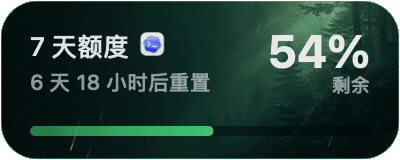 |  |
| 颜色随额度主题变化 | 远中近景斜雨层次 | 六向分枝雪晶连续飘落 |

## 效果展示

### 不同额度主题

卡片会根据 7 天剩余额度切换环境，背景、边框颜色和进度条保持一致，并按 30% / 30% / 30% / 10% 分段：`70–100%` 为森林、`40–<70%` 为秋天、`10–<40%` 为末日、`0–<10%` 为废土。


### 星屿生态舱背景套系（macOS）

除默认“额度森林”外，右键卡片打开“背景套系”，可切换到“星屿生态舱”。它以同一座玻璃微缩生态岛呈现四个额度阶段：充足时为青绿苔原与发光溪流，下降后逐渐转为铜金、红紫裂变和银灰冻结；边框与进度条同步采用当前阶段的主题色。

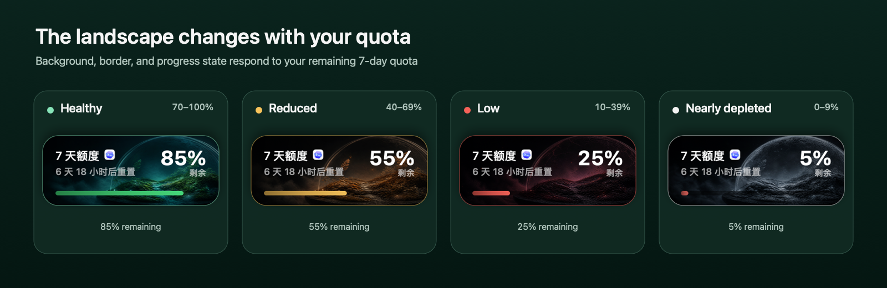

这套背景有独立的环境动效：森林为上升孢子、秋林为金色星尘、末日为逆风火屑、废土为六向霜晶。卡片每 3 秒轻量播放一次；双击则按 4、9、16、9、4 颗的五段密度触发 42 颗主题粒子，形成先少、后多、再少的完整动画。

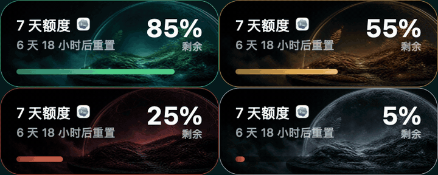

### 云海灯塔背景套系（macOS）

第三套“云海灯塔”采用更开阔的高空世界：同一座悬浮灯塔会从蓝色云海和青色信标，逐渐进入铜金黄昏、红紫雷暴，最终在银白云层中完全冻结。右键卡片打开“背景套系”即可切换，边框和进度条仍然跟随额度阶段变化。

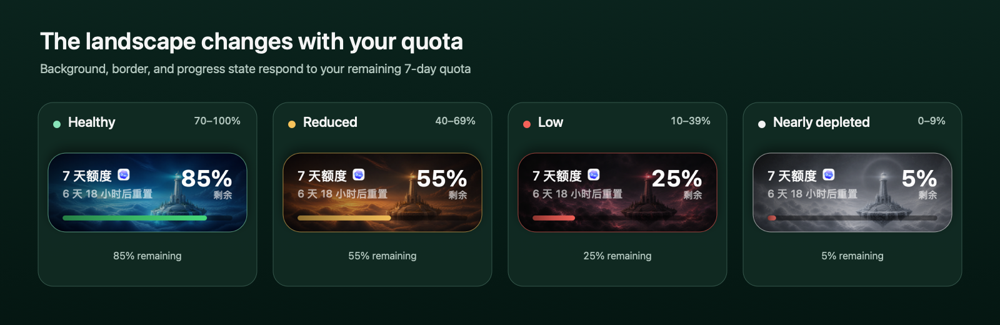

它使用独立的飞鸟动效：鸟群从右侧自然掠过，翅膀持续扇动，并以青蓝、金色、暗红和灰白跟随四个额度阶段。暴风阶段的上下扰流更强，冻结阶段则更慢、更疏。每 3 秒轻量播放一次；双击时按 2、6、11、6、2 只的五段节奏触发 27 只飞鸟，队形先稀疏、再聚集、最后散开。

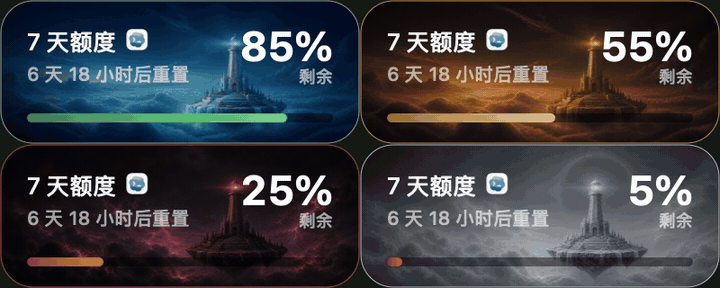

### 月光花房背景套系（macOS）

第四套“月光花房”采用克制的女性化新艺术风格：同一座月夜玻璃花房会从珍珠薰衣草与雾粉牡丹，逐渐进入玫瑰金暮色、石榴红蚀月和银灰冻结。画面保留左右文字区与底部进度条区域，边框和进度条仍跟随额度阶段同步变化。

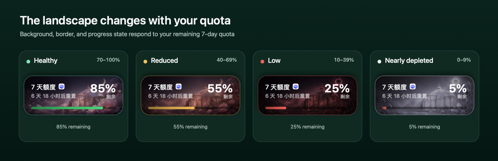

它使用独立的月蝶动效：珍珠浅粉、玫瑰金、石榴红和银白蝶群会随额度阶段切换颜色与飞行状态。蝶翼持续轻微扇动，轨迹包含不同景深、曲线和速度；每 3 秒轻量播放一次，双击时按 2、6、12、7、3 只的五段节奏触发 30 只月蝶，形成先少、后多、再散去的完整动画。

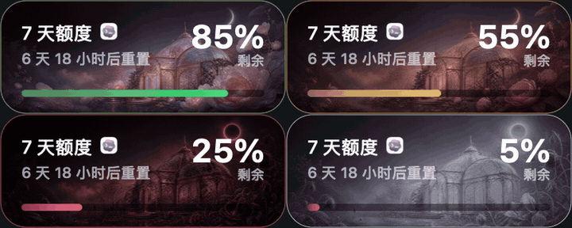

### 深海幻境背景套系（macOS）

第五套“深海幻境”进入一片无边框的生物荧光海域：同一片珊瑚海床会从青蓝繁盛，逐渐转为铜金衰退、石榴红海沟和银灰白化。画面完整铺满卡片，不包含额外观测窗框；边框和进度条继续随额度阶段同步变化。

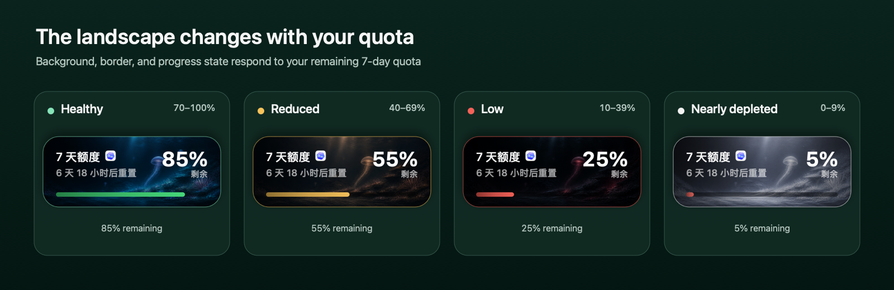

它使用独立的水母动效：青蓝、琥珀、石榴红和银白水母会从右下方缓慢向左上方漂浮，伞体持续收缩舒展，触手随水流弯曲，并以不同大小、清晰度和速度形成景深。每 3 秒轻量播放一次；双击时按 1、4、8、5、2 只的五段节奏触发 20 只水母，先稀疏进入、中段聚集，最后缩小并淡出海水深处。

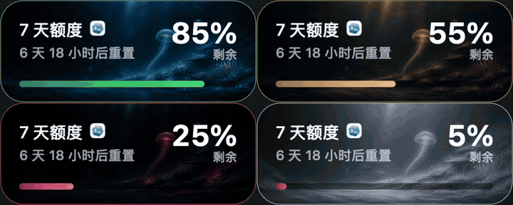

### 主题同步落叶动效

macOS 卡片会在额度下降时播放落叶，并在卡片可见且系统未开启“减少动态效果”时，每 3 秒自动播放一次轻量环境动效。macOS 与 Windows 双击卡片都会在刷新额度的同时触发一次 48 片大量落叶：叶片以低初速从右上方进入，按 4、10、19、10、5 片的五段密度先少后多再少。同一股风场先增强再衰减，不同景深的叶片以不同响应速度被牵引；中段短暂的横向湍流和上托、下沉分层使叶流自然散开，不会集中成一束。重力和垂直空气阻力使轨迹从倾斜漂移自然转为下落。接近底部时，叶片会同时缩小、变淡并轻微虚化，形成被风带向远处的景深退场。叶片颜色跟随当前额度主题：森林为鲜绿、秋林为橙红、末日为暗红褐、废土为灰白。


### 当地天气雨雪动效

macOS 可选“跟随当地天气”。用户主动授权后，当地下雨时显示远中近分层斜雨；下雪、阵雪或雨雪混合时显示六向树枝状雪晶。两种效果都在卡片隐藏、贴边收纳或系统开启“减少动态效果”时自动暂停。


### 收起、展开与贴边隐藏

收起状态保留核心额度信息；单击卡片展开订阅计划和数据更新时间；拖到屏幕左右边缘后自动收纳成 16 pt 的深色主题切片，悬停时完整卡片会临时滑出。


### Windows 紧凑高 DPI 布局

Windows 版按 macOS 卡片的物理观感重新换算为紧凑尺寸，系统缩放只提升渲染清晰度，不再把卡片设计尺寸重复放大。

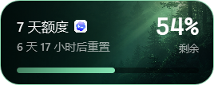

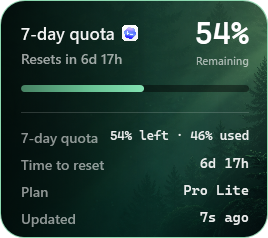

## 特点

- macOS 为 `200 × 80 pt` 收起、`200 × 178 pt` 展开；Windows 为 `268 × 107 DIP` 收起、`268 × 238 DIP` 展开，按单位换算匹配 macOS 的物理观感，并由 WPF 适配高 DPI 缩放。
- macOS 内置“额度森林”“星屿生态舱”“云海灯塔”“月光花房”和“深海幻境”五套背景套系，每套都覆盖森林、秋天、末日和废土四个额度阶段。
- macOS 支持额度下降触发和每 3 秒一次的轻量落叶动效；叶片颜色、进度条和边框与当前主题同步。
- macOS 可选“跟随当地天气”：主动授权后，每 15 分钟查询一次模糊化当前位置的天气；当地下雨时显示分层斜雨，下雪时显示树枝状雪晶。该功能默认关闭。
- macOS 可从右键菜单切换背景套系或选择自定义背景；图片会缩放后复制到本机应用数据目录，重启后继续使用，并可随时恢复默认“额度森林”。
- 根据系统首选显示语言自动使用中文或英文；中文系统显示中文，其他系统默认显示英文。
- 每 10 秒扫描一次本机 Codex 额度记录；双击或右键可立即刷新。额度读取不请求网络，也不消耗 Token。
- 双击刷新并触发大量主题动效；“额度森林”播放落叶，“星屿生态舱”播放孢子、星尘、火屑或霜晶，“云海灯塔”播放飞鸟群，“月光花房”播放月蝶，“深海幻境”播放收缩舒展的水母群，单击与双击互不误触。
- 任意位置拖动并记住位置；贴到屏幕左右边缘后收纳成 16 pt 的深色主题卡片切片，内嵌竖向额度条。
- macOS 版会跟随 Codex/ChatGPT 桌面客户端显示或隐藏；Windows 版保留最近一次可信快照，Codex 暂时退出时仍可查看。
- 右键可刷新、选择或恢复背景、开关天气联动、重置位置、管理登录启动和退出。
- 不占用 macOS Dock 或 Windows 任务栏，不上传额度或 Codex 日志，也不包含遥测。只有主动开启天气联动后才会向 Open-Meteo 发送模糊化位置查询当前天气。

## 系统要求

- macOS 13 或更高版本，Apple Silicon Mac（arm64）；或 Windows 10/11 x64。
- 本机 Codex/ChatGPT 桌面客户端产生过含额度状态的运行事件。

## 下载与安装

前往 [GitHub Releases](https://github.com/Ayang0097/quota-grove/releases/latest) 下载对应系统版本：

- macOS：`Quota-Grove-*-macos-arm64.zip`，解压后将 `Quota Grove.app` 拖入“应用程序”文件夹。
- Windows：`Quota-Grove-*-windows-x64.zip`，解压后运行 `QuotaGrove.exe`。这是便携版，不要求预装 .NET。

当前公开构建采用 ad-hoc 签名，尚未经过 Apple Developer ID 公证。首次打开提示的处理方式见 [首页安装说明](../README.md#安装与第一次使用)。

Windows 公开构建当前没有商业代码签名证书，首次运行可能出现 Microsoft Defender SmartScreen 提示；请仅从本仓库 Releases 下载，并可使用随包提供的 SHA-256 校验值核对文件。

## 从源码构建

### macOS

在项目目录运行：

```bash
./install.sh
```

脚本会构建 Release 应用、进行 ad-hoc 签名、安装到：

```text
~/Applications/Quota Grove.app
```

然后自动启动。右键卡片，勾选“登录时启动”可创建用户级 LaunchAgent，不需要管理员权限。

### Windows

需要 .NET 8 SDK。测试、构建和便携版发布命令见 [Windows 开发说明](../windows/README.md)。公开下载包为自包含的 Windows x64 单文件应用。

## 使用

- 单击：展开或收起。
- 双击：立即重新扫描本机额度事件，并触发一次大量主题动效。
- 拖动：移动卡片；拖到当前显示器可用区域的左/右边缘后收纳。
- 悬停收纳条：临时滑出完整卡片。
- 右键：打开刷新、背景套系、自定义背景、天气联动、登录启动、位置重置、隐私和退出菜单。

### 自定义背景（macOS）

右键卡片可先在“背景套系”中选择“额度森林”“星屿生态舱”“云海灯塔”“月光花房”或“深海幻境”；选择“自定义背景…”则可使用 PNG、JPEG、HEIC 等系统可读取的图片。应用会按最长边不超过 2400 像素进行缩放，并保存为：

```text
~/Library/Application Support/Quota Grove/custom-background.png
```

自定义图片只替换背景画面；边框、进度条和落叶颜色仍会随剩余额度主题变化。右键选择“恢复默认背景”即可回到“额度森林”。图片完全保存在本机，不会上传。

### 跟随当地天气（macOS）

右键卡片并勾选“跟随当地天气”后，系统会弹出一次位置权限提示。Quota Grove 只请求公里级定位，将经纬度四舍五入到两位小数后用于 Open-Meteo 当前天气查询。天气每 15 分钟更新；当前下雨时显示雨效，降雪或雨雪混合时显示雪效。卡片隐藏、贴边收纳或系统开启“减少动态效果”时，天气动画暂停。关闭开关后不再定位或请求天气。

天气数据来源：[Open-Meteo](https://open-meteo.com/)（CC BY 4.0）。免费接口仅用于非商业版本；商业分发前需要采用符合其商业条款的方案。

## 验证真实数据

macOS 应用附带两个不启动窗口的诊断命令：

```bash
"~/Applications/Quota Grove.app/Contents/MacOS/QuotaGrove" --snapshot-json
"~/Applications/Quota Grove.app/Contents/MacOS/QuotaGrove" --self-test
```

`--snapshot-json` 只输出标准化额度快照。`--self-test` 当前覆盖 147 项主题边界、背景套系、视觉规则、落叶、星屿粒子、灯塔飞鸟、月蝶、水母、雨滴与雪花粒子、天气判定、额度日志防回退、解析和中英文切换检查，包括当前 70、40、10 三个切换点及其相邻值。

## 手动构建

```bash
swift build
./Scripts/build-app.sh
```

生成的应用位于 `dist/Quota Grove.app`。

## 卸载

```bash
./uninstall.sh
```

卸载脚本会停止应用、删除登录启动项和本地偏好，并把应用本体移到废纸篓。

## 数据与兼容性说明

OpenAI 目前没有为个人订阅公开稳定的“剩余百分比”API。本工具独立解析 macOS 的 `~/.codex/sessions` 或 Windows 的 `%USERPROFILE%\.codex\sessions` 中最近运行事件里的 `rate_limits` 字段，忽略单独模型的专属额度事件，并优先选择 Codex 总额度中 10080 分钟的 7 天窗口。Windows 还支持通过 `QUOTA_GROVE_CODEX_HOME` 或 `CODEX_HOME` 指定兼容目录。

该字段属于本机兼容性适配，不是官方稳定接口。暂时无法取得新数据时，工具会继续显示最近可信快照；展开卡片可查看“数据更新”时间。从未取得过数据时显示 `--%`，不会猜测，也不会尝试绕过访问控制。详见 [data-source-notes.md](../data-source-notes.md) 与 [PRIVACY.md](../PRIVACY.md)。

## 独立实现声明

本项目依据 `Quota-Grove-PRD.md` 从空目录独立实现，没有读取、复制或改写同类项目的代码、脚本、README 或文件结构。Quota Grove 应用图标为本项目独立绘制；“额度森林”四张正式主题背景由产品负责人提供，“星屿生态舱”“云海灯塔”“月光花房”和“深海幻境”背景由本项目使用 OpenAI ImageGen 专门生成，程序化回退背景为本项目独立绘制。落叶粒子素材同样由本项目使用 OpenAI ImageGen 专门生成并经本地分割、调色和动态模糊处理；星屿粒子、灯塔飞鸟、月蝶与水母则由应用代码实时绘制，均未复制第三方素材包。

`Assets/CodexIcon.png` 来自本机安装的官方 Codex/ChatGPT 桌面应用，仅作为额度来源标识使用。该图标及“OpenAI”“Codex”“ChatGPT”等名称或商标的相关权利归其各自权利人所有，不包含在本项目许可证授予的权利范围内。详见 [素材来源](../asset-sources.md)、[第三方声明](../THIRD_PARTY_NOTICES.md) 和 [LICENSE](../LICENSE)。

Quota Grove 是非官方工具，与 OpenAI 无隶属或背书关系。

## 许可证

本仓库代码、文档和自有视觉资产采用 [LICENSE](../LICENSE) 中的保留权利许可。`Assets/CodexIcon.png` 属于明确排除的第三方品牌资产，不因收录在本仓库中而获得再许可。
